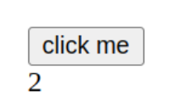

# Webflex
Purely functional web applications for Reflex FRP. This (experimental) library allows you to write a web application as a single program, in a truly functional and composable way. No `IO` here!

## Introduction with a click-counter example
For a quick introduction, let's write a simple click counter application using Webflex (code below). Here's what it will end up looking like:



```haskell
module WebCounter where

import Reflex
import Reflex.Dom
import Webflex.Class

import Control.Monad.Fix
import qualified Data.Text as T

webcounter ::
  forall c s m.
  ( WebM c s m,
    Reflex s,
    Reflex c,
    DomBuilder c (CM m),
    PostBuild c (CM m),
    MonadHold c (CM m),
    MonadHold s (SM m),
    MonadFix (SM m),
    Monad m
  ) =>
  m ()
webcounter = do
  clicks :: Event c () <- liftC $ button "click me"
  clicksAtS :: Event s (C m, ()) <- atSE clicks
  countAtS :: Dynamic s Integer <- liftS $ count clicksAtS
  countC :: Dynamic c Integer <- atAllCDyn 0 countAtS
  liftC_ $ el "div" $ dynText (fmap (T.pack . show) countC)
  pure ()
```

### The `WebM` monad and basic Webflex functions

In the Webflex monad `WebM c s m` the client and server have different Reflex timelines and monads. These are the `c`, `s`, `CM m`, and `SM m` types in the signature of `webcounter`.
For example, the client monad `CM m` supports Reflex DOM as denoted by the constraint `DomBuilder c (CM m)`.
A final type Webflex introduces is the client identifier `C m`, which uniquely identifies any client connected to the server.

To make the client show a button, we write `liftC $ button "click me"`. The `liftC` function takes a value in the client monad and lifts it into the Webflex monad. The `liftC` expression returns a value of type `Event c ()`. In Webflex such a type denotes a set of event occurrences at *any* client.

With the `atSE` function we can obtain a server-side event of when the click events at the client have been propagated to the server. The clicks are tagged with the client identifier.

Finally we can use the standard Reflex `count` function on the server to compute the total number of clicks as a Dynamic of integer. The updates to this dynamic can be captured at all the clients with `atAllCDyn`, and then shown with the Reflex DOM `dynText` function.

## Implementation
The implementation has two sides:
- A pure base implementation found in
  [webflex-core:Webflex.Base](webflex-core/src/Webflex/Base.hs). This
  implements the interface by translating the functions to
  operations on two monad transformer stacks. One for the server
  (`ServerT`) and one for the client (`ClientT`).
- Simulator, client, and server implementations. These take the result
  of running the client/server transformer stacks and either simulate
  a Webflex program as a regular Reflex program playing both client
  and server sides
  ([weflex-sim:Webflex.Sim](webflex-sim/src/Webflex/Sim.hs)), or as a HTTP
  server and a browser implementation
  ([webflex-server:Webflex.Server](webflex-server/src/Webflex/Server.hs) and [webflex-client:Webflex.Client](webflex-client/src/Webflex/Client.hs)).

### Pure implementation
The `ServerT` asd `ClientT` transformers are Reader-EventWriter-State stacks:
- They number uses of `atCE` and `atSE` via a counter (State) such
that the number for is the same on client and server.
- The argument events to those functions are then tagged with the
number and passed to `tellEvent` (EventWriter).
- The appropriate return values of the functions are looked up up from
an `Event t (Map Int Value)` value (Reader).

The transformers only implement *one side* of the `WebM` class. The
design of the class makes sure that a client-tagged value or monad
(`c` or `CM`) will never be evaluated on the server and vice-versa.
To keep the compiler happy I've added a "Void" implementation of
Reflex and Reflex-DOM classes in which all functions are `undefined`
([reflex-extras:Reflex.Void](reflex-extras/src/Reflex/Void.hs)).

## Examples

There is a simulator for Webflex so that you can easily test out programs.

See `webflex-todomvc` for a client-server version of `reflex-todomvc`.

Run `nix-shell --run "cabal run exe:counter-sim"` for a simulated button-click counter app (shows the total number of clicks of a button).
